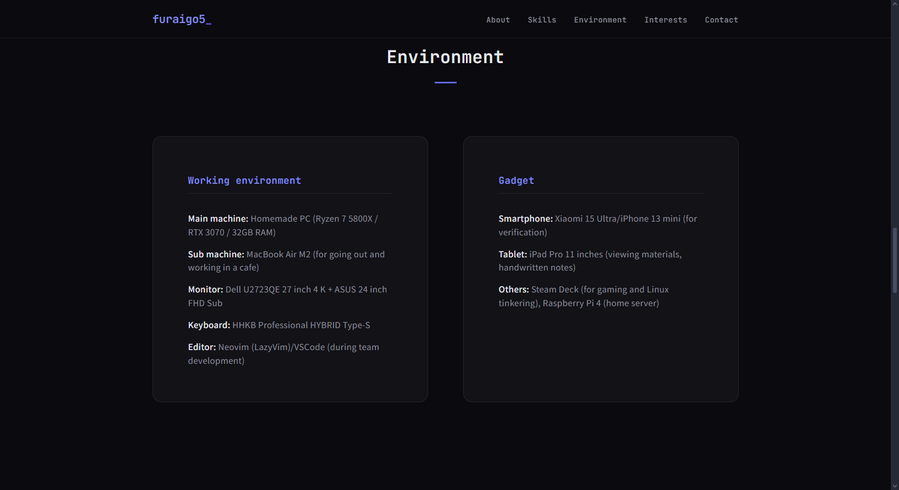
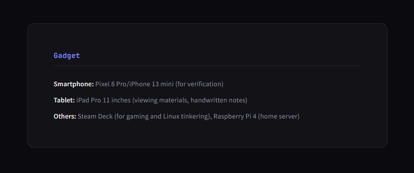

# debeyohiru\_06\_hidden2

### 📝 Challenge Description

> We want to know the smartphone models debeyohiru is believed to have used as of December 2025.
>
> Flag Format: `SWIMMER{Model1_Model2}` _Note: Order does not matter. Do not include the manufacturer name._

### 🔍 Investigation Process

#### 1. Initial Pivot & Asset Discovery

The investigation began using a pivot point from a previous challenge: the old username furaigo5.

By searching for this handle, I located the target's GitHub profile and their personal portfolio website:

* GitHub: `github.com/furaigo5`
* Portfolio: `https://furaigo5.github.io/profile/`

#### 2. Live Portfolio Analysis

Upon visiting the live portfolio link, I inspected the section dedicated to the target's hardware. Two devices were listed in the current state.

<figure><figcaption></figcaption></figure>

* Finding: The live site currently lists the Xiaomi 15 Ultra and iPhone 13 mini.

#### 3. Digital Archeology: The Archive Hunt

Since the challenge specifically asks for devices used as of December 2025, I needed to check the site's history to see if the Xiaomi 15 Ultra—a newer flagship—was already in use or if there was a predecessor.

* Step 1: Wayback Machine: I checked `web.archive.org` for snapshots of the portfolio. No relevant historical snapshots were available.
* Step 2: Source Code Inspection: I checked the HTML source of the portfolio for hidden comments or previous strings. This yielded no results.
* Step 3: Alternative Archivers: I expanded the search to other web archiving services, specifically `archive.md`.

#### 4. Breakthrough via Archive.md

While the Wayback Machine was empty, archive.md had successfully captured a snapshot of the portfolio on January 2, 2026.

Upon viewing this archived version, I noticed a slight but critical difference in the "current gadgets" section compared to the live site.

<figure><figcaption></figcaption></figure>

* Historical Finding: In the archive from January 2, 2026, the devices listed were the Pixel 8 Pro and iPhone 13 mini.

***

### 💡 Analysis & Solution

By comparing the archived snapshot (January 2, 2026) with the current live version, the transition becomes clear:

1. Shared Device: The iPhone 13 mini appears in both the archive and the live site, indicating it was used throughout the December 2025 period.
2. Transition Device: The Pixel 8 Pro was the primary Android device as of late 2025/early 2026, before being replaced by the Xiaomi 15 Ultra on the live site.

#### 🚩 Final Flag

`SWIMMER{Pixel 8 Pro_iPhone 13 mini}`

***

#### 🛡️ OSINT Pro-Tip

When solving "Time-Travel" OSINT challenges, archive.md (Archive.today) is a vital resource. It often captures one-off snapshots of personal portfolios that larger crawlers like the Wayback Machine might miss due to low traffic or strict `robots.txt` files.

If you have any questions feel free to dm me [xreru](https://app.gitbook.com/u/sV63NjWn0kbva4C066LUjfLD3y92 "mention") or in [linkedin](https://www.linkedin.com/in/reru/)
