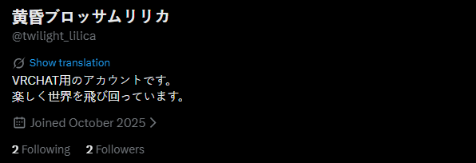
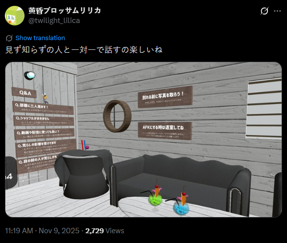
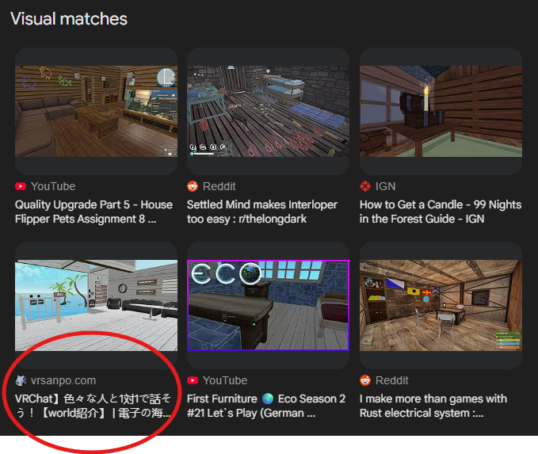
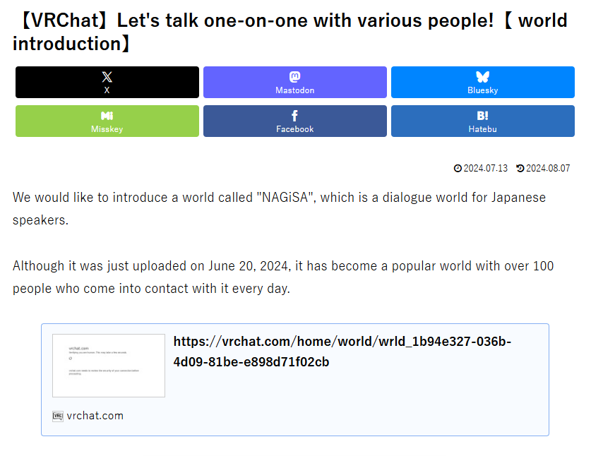
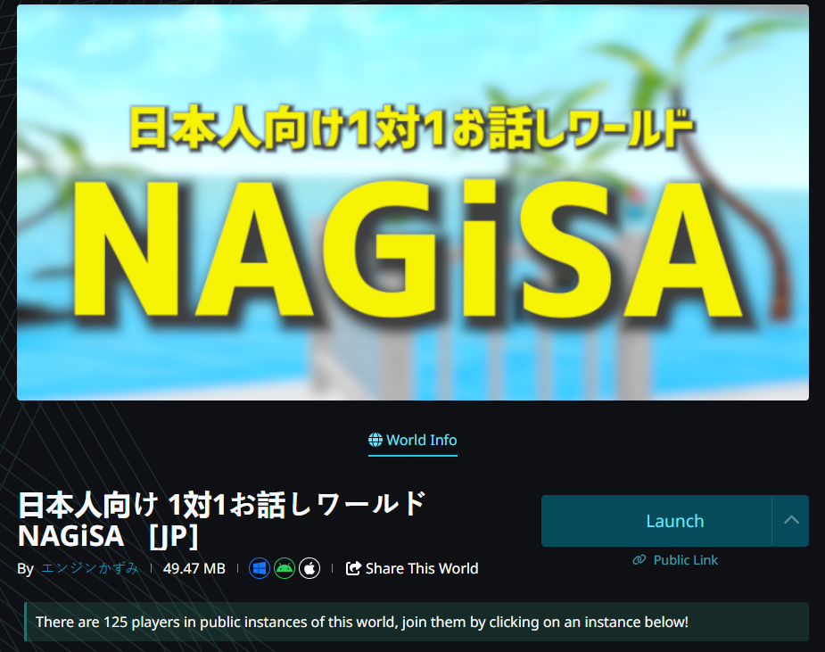

# lilica\_03\_virtual\_world

### 📝 Challenge Description

> It seems lilica posted about VRChat activity on social media. In an image posted on November 9, 2025 (JST), a certain "world" appears. Please answer the ID of this world.
>
> Flag Format: `SWIMMER{wrld_xxxxxxxx-xxxx-xxxx-xxxx-xxxxxxxxxxxx}`&#x20;

### 🔍 Investigation Process

#### 1. Social Media Monitoring

Building on findings from a previous challenge, I navigated to lilica's identified X (formerly Twitter) account.

<figure><figcaption></figcaption></figure>

By filtering for posts around November 9, 2025, I located a specific tweet where lilica mentioned playing VRChat. The post included a high-quality screenshot of an in-game environment.

<figure><figcaption></figcaption></figure>

#### 2. Visual Intelligence (Reverse Image Search)

To identify the specific world shown in the screenshot, I performed a Reverse Image Search (RIS). While Yandex is often preferred for landmarks, Google Lens provided the most accurate match in this instance.

<figure><figcaption></figcaption></figure>

The search results pointed toward a Japanese VRChat world review site: `vrsanpo.com/vrchat-world-nagisa/`.

#### 3. World Identification

The website identified the world as "Nagisa." The page contained a direct link to the VRChat world preview on the official `vrchat.com` domain.

<figure><figcaption></figcaption></figure>

By clicking the link and logging into the VRChat Home portal, I was able to access the technical metadata for the world.

<figure><figcaption></figcaption></figure>

#### 4. Data Extraction

The URL for the world was: `https://vrchat.com/home/world/wrld_1b94e327-036b-4d09-81be-e898d71f02cb`

Following the challenge requirements, I extracted the unique world ID starting with `wrld_`.

***

### 💡 Analysis & Solution

The screenshot posted by lilica belongs to the world Nagisa. By pivoting from social media to a reverse image search and finally to the official VRChat database, the specific ID was confirmed.

#### 🚩 Final Flag

`SWIMMER{wrld_1b94e327-036b-4d09-81be-e898d71f02cb}`

***

#### 🛡️ OSINT Pro-Tip

Pivoting through niche blogs: In VRChat or gaming OSINT, direct image searches often lead to community blogs or "world tour" websites (like _vrsanpo_). These sites are goldmines because they frequently include direct database links or IDs that aren't easily searchable through the main platform's UI without a login.

If you have any questions feel free to dm me [xreru](https://app.gitbook.com/u/sV63NjWn0kbva4C066LUjfLD3y92 "mention") or in [linkedin](https://www.linkedin.com/in/reru/)
